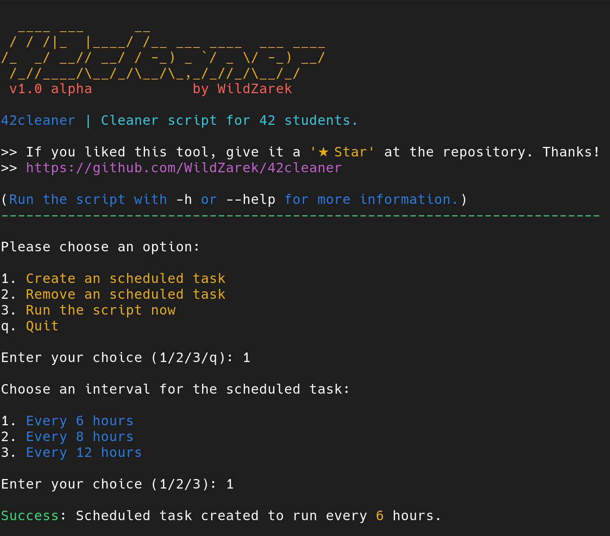

# 42cleaner

42cleaner is a Python script designed to clean temp/cache files and unnecessary older versions from Snap.

It helps to free up disk space and maintain system performance.

It can be scheduled for automatic background execution (using cron).

Made for 42 students. Tested on **42 Málaga** school running **Linux/Ubuntu**. NOT for macOS.



# Why?

Due to the limit of 5 GB size for 'home' directory and looking to provide a solution
for the problem with the Snap package manager which is not removing properly
old versions (revisions), this tool has born to solve that problem.

# Trash files

This tool removes the following files:

- Empties recycle bin (Trash).
- All .zcompdump files (A cache file used by compinit).
- All Cache files in our home (~/.cache)
- Cache files from vscode (~/.config/Code/Cache and ~/.config/Code/CachedData)
- Cache files from firefox (~/snap/firefox/common/.cache)
- Cache files from slack (~/snap/slack/common/.cache)
- All temp files created by Francinette. (~/francinette/temp)
- Older versions (revisions) from installed Snap packages.

# Alias for easy usage

The script can set up an alias automatically in your shell's config file.

This will make extremely easy to remember the shell command to run it next time.

- **Verbose Mode**: Some prompts are only visible if this flag are used.

> [!NOTE]
> If you do not see any prompt, maybe an error has occurs (like config file does not exist or alias already existing in file)
> Is not an error, just use the flag --verbose to avoid this behavior.

# Scheduled tasks and modes

The script allows you to choose from different time intervals so that the task runs automatically in the background.

- **Silent Mode**: This mode is intended to run the script in the background, without any prompts.
- **Verbose Mode**: This mode is intended to run the script without the flag **--silent** and for printing additional information.

# How to use

```
usage: 42cleaner.py [-h] [-s]

Cleaner script for 42 students.

options:
  -h, --help    show this help message and exit
  -s, --silent  runs the script in silent mode without any prompts
  -v, --verbose runs the script in verbose mode with additional prompts
```

Clone this repository by using the following command:

```bash
git clone https://github.com/WildZarek/42cleaner.git
```

Then, move to the new downloaded folder:

```bash
cd 42cleaner
```

Finally, run the script (sudo permissions not needed):

```bash
python3 42cleaner.py
```

> [!TIP]
> If the alias was configured previously, just run it as follows:
> $> 42cl

> [!NOTE]
> If the used space in your 'home' is under 60%, the tool doesn't do any operation.
>
> Otherwise, the tool performs the needed operations to free space.

> [!WARNING]
> The cron task (if configured) will not synchronize on other computers on campus,
> this is due to 42's own configuration, so it is not a problem with the script.
>
> Therefore, it's necessary to configure the cron task every time you want to use this functionality.

# Acknowledgments

Thanks to [@4ndymcfly](https://github.com/4ndymcfly) for his contributions.

# License

This work is published under the terms of **[42 Unlicense](https://github.com/gcamerli/42unlicense)**.