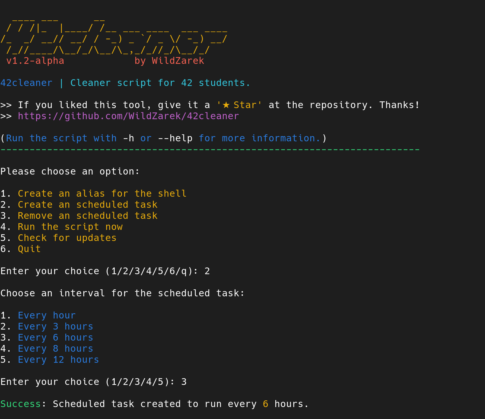

# 42cleaner

Python script to clean temp files and older versions from Snap.
To be used at 42school.



# Why?

Due to the limit of 5 GB size for 'home' directory and looking to provide a solution
for the problem with the Snap package manager that is not removing properly
old versions cache, this tool has born to solve that problem.

# Trash files

This tool removes the following files:

- Empties recycle bin (Trash).
- All .zcompdump files (A cache file used by compinit).
- All temp files created by Francinette.
- All older versions from installed Snap packages.

# How to use

Clone this repository by using the following command:

```bash
git clone https://github.com/WildZarek/42cleaner.git
```

Then, change to the new downloaded folder:

```bash
cd 42cleaner
```

Finally, run the script (sudo permissions not needed):

```bash
python3 42cleaner.py
```

> [!NOTE]
> If the used space in your 'home' is under 70%, the tool doesn't do any operation.
>
> Otherwise, the tool performs the needed operations to free space.

# License

This work is published under the terms of **[42 Unlicense](https://github.com/gcamerli/42unlicense)**.